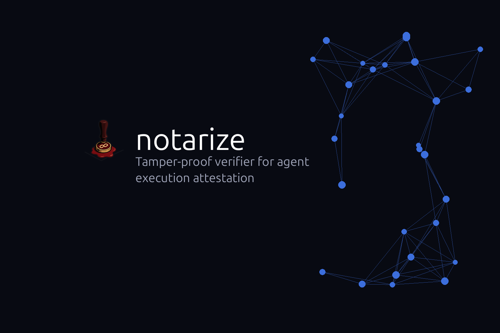
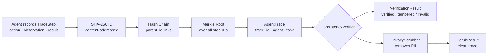

# notarize

**Canonical trace format and verifier for agent execution attestation.**



[](https://github.com/sandeep-alluru/notarize/actions/workflows/ci.yml)
[](https://pypi.org/project/notarize/)
[](https://pypi.org/project/notarize/)
[](https://pypi.org/project/notarize/)
[](LICENSE)
[](https://codecov.io/gh/sandeep-alluru/notarize)
[](https://mypy-lang.org/)

[Quick Start](#quick-start) · [How It Works](#how-it-works) · [CLI Reference](#cli-reference) · [GitHub Action](#github-action) · [vs. Alternatives](#vs-alternatives) · [Contributing](CONTRIBUTING.md)

---

## Why

AI agents produce execution traces. Those traces are the primary audit artifact for regulatory compliance, forensic analysis, and debugging. The problem: no canonical format, no tamper detection, no PII scrubbing pipeline.

When an agent's trace is submitted for an EU AI Act audit, how do you know it hasn't been modified? How do you ensure personal data was redacted before storage? How do you verify the step sequence is internally consistent?

notarize solves this by treating agent traces like signed commits: every step is content-addressed, steps are hash-chained, and a Merkle root seals the whole trace. Tamper any step and the verifier catches it.

```
notarize verify trace.json   # exits 1 if tampered
notarize scrub trace.json    # removes PII before storage
```

---

## How It Works



**Core primitives:**

- **TraceStep** — a single agent action with SHA-256[:16] ID derived from step_index, action, observation, and result.
- **AgentTrace** — a hash-chained sequence of TraceSteps with a Merkle root sealing the whole trace.
- **ConsistencyVerifier** — checks hash chain integrity, Merkle root, step indices, and trace ID.
- **PrivacyScrubber** — structure-preserving PII redaction (email, phone, credit card, SSN, IP).

---

## Features

| Feature | Details |
|---------|---------|
| Content-addressed steps | Same step content always produces the same ID |
| Hash chain | Each step's parent_id links to the previous step's ID |
| Merkle root | Seals the full trace — tamper any step and it breaks |
| 5 verification checks | Chain integrity, Merkle root, monotonic indices, no duplicates, trace ID |
| PII scrubbing | Removes email, phone, credit card, SSN, IP addresses |
| SQLite store | Local-first, no server required |
| CLI | `verify`, `scrub`, `log`, `status` subcommands |
| FastAPI REST server | `/verify`, `/scrub`, `/traces`, `/trace/{id}` endpoints |
| MCP server | Model Context Protocol integration for Claude and other agents |
| 50+ tests | Comprehensive test suite, 85%+ branch coverage |

---

## Quick Start

```bash
pip install notarize
```

```python
from notarize import AgentTrace, TraceStep, ConsistencyVerifier, PrivacyScrubber

# Build a trace
steps = [
    TraceStep(0, "tool_call:search", "Found 5 results", "success", tool_name="search"),
    TraceStep(1, "tool_call:read",   "Read file content", "success", tool_name="read"),
    TraceStep(2, "tool_call:write",  "Wrote output", "success", tool_name="write"),
]
trace = AgentTrace(
    trace_id="audit-2024-001",
    agent_name="compliance-agent",
    task="Review contract documents",
    steps=steps,
)

# Verify internal consistency
verifier = ConsistencyVerifier()
result = verifier.verify(trace)
print(result.verdict)  # "verified"

# Scrub PII before storing
scrubber = PrivacyScrubber()
scrub = scrubber.scrub(trace)
print(scrub.replacements_count)  # 0 (no PII in this trace)
```

---

## CLI Reference

```bash
notarize [--db PATH] COMMAND [OPTIONS]
```

| Command | Description | Key options |
|---------|-------------|-------------|
| `verify FILE` | Verify a JSON trace file for consistency | `--format {rich,json}`, `--save` |
| `scrub FILE` | Scrub PII from a trace file | `-o OUTPUT` |
| `log` | List all stored traces | — |
| `status` | Show store info (trace/result counts) | — |

**Global options:**

| Option | Default | Env var |
|--------|---------|---------|
| `--db PATH` | `.notarize/traces.db` | `NOTARIZE_DB` |

**Examples:**

```bash
# Verify a trace
notarize verify trace.json

# Verify and save to the database
notarize verify trace.json --save

# Scrub PII and output to stdout
notarize scrub trace.json

# Scrub PII and save to file
notarize scrub trace.json -o scrubbed.json

# List stored traces
notarize log

# Show store statistics
notarize status
```

---

## GitHub Action

Add notarize verification to your CI pipeline:

```yaml
# .github/workflows/notarize.yml
name: Verify agent traces
on: [push, pull_request]

jobs:
  verify:
    runs-on: ubuntu-latest
    steps:
      - uses: actions/checkout@v4
      - uses: sandeep-alluru/notarize@main
        with:
          trace-file: traces/latest.json
          fail-on-tampered: "true"
```

The action installs notarize and runs `notarize verify` on the specified trace file. See [docs/github-action.md](docs/github-action.md) for full documentation.

---

## vs. Alternatives

| | notarize | LangSmith | Arize Phoenix | Weave (W&B) | OpenTelemetry |
|---|---|---|---|---|---|
| **Hash-chained steps** | Yes — tamper-evident | No | No | No | No |
| **Merkle root attestation** | Yes | No | No | No | No |
| **EU AI Act / audit focus** | Yes | No | No | No | No |
| **PII scrubbing built-in** | Yes | No | Partial | No | No |
| **Offline / local-first** | Yes — single SQLite | No (cloud) | Partial | No (cloud) | Partial |
| **Content-addressed steps** | Yes | No | No | No | No |
| **Open source** | MIT | Closed | MIT | Apache 2.0 | Apache 2.0 |
| **Primary purpose** | Trace attestation | Observability | ML monitoring | Experiment tracking | Distributed tracing |

notarize is purpose-built for compliance audit use cases where tamper-evidence and PII handling are first-class requirements.

---

## Claude / MCP integration

notarize ships a Model Context Protocol server that lets Claude and other MCP-compatible agents verify and scrub traces directly:

```bash
# Start the MCP server
python -m notarize.mcp_server

# In your Claude Code project's .claude/settings.json:
{
  "mcpServers": {
    "notarize": {
      "command": "python",
      "args": ["-m", "notarize.mcp_server"]
    }
  }
}
```

Once connected, Claude can call `verify_trace`, `scrub_trace`, and `list_traces` as tools. See [docs/mcp.md](docs/mcp.md) for the full tool schema.

---

## OpenAI integration

notarize exposes a FastAPI REST server compatible with OpenAI's function-calling format. The tool definitions are in [`tools/openai-tools.json`](tools/openai-tools.json) and the full API spec is in [`openapi.yaml`](openapi.yaml).

```bash
# Start the REST server
uvicorn notarize.api:app --reload

# Pass to Codex CLI or any OpenAI-compatible agent
codex --tools tools/openai-tools.json "Verify the latest agent trace"
```

Endpoints: `GET /health`, `POST /verify`, `POST /scrub`, `GET /traces`, `GET /trace/{id}`. See [docs/openai.md](docs/openai.md) for details.

---

## Repository structure

```
notarize/
├── src/
│   └── notarize/
│       ├── trace.py          # TraceStep, AgentTrace dataclasses + hash chain
│       ├── verifier.py       # ConsistencyVerifier, VerificationResult
│       ├── scrubber.py       # PrivacyScrubber, ScrubResult + PII patterns
│       ├── store.py          # SQLite-backed TraceStore
│       ├── report.py         # print_result(), print_trace(), to_json(), to_markdown()
│       ├── cli.py            # Click CLI (verify, scrub, log, status)
│       ├── api.py            # FastAPI REST server
│       └── mcp_server.py     # MCP server
├── tests/
│   ├── test_trace.py         # TraceStep, AgentTrace, hash chain, merkle root
│   ├── test_verifier.py      # ConsistencyVerifier with valid/tampered/invalid traces
│   ├── test_scrubber.py      # PII patterns, replacement, ScrubResult
│   ├── test_store.py         # TraceStore save/get/list
│   ├── test_report.py        # Formatters
│   ├── test_cli_runner.py    # Click CliRunner tests
│   └── test_api.py           # FastAPI TestClient tests
├── examples/
│   └── demo.py               # Standalone demo script
├── docs/                     # MkDocs documentation
├── tools/
│   └── openai-tools.json     # OpenAI function-calling tool definitions
├── assets/
│   ├── hero.png              # README hero image
│   └── logo.png              # Project logo
├── action.yml                # GitHub Action
├── openapi.yaml              # OpenAPI 3.1 spec
├── pyproject.toml            # Package metadata + dependencies
└── CONTRIBUTING.md           # Contribution guide
```

---

## GitHub Topics

Suggested topics for discoverability:

`ai-agents` `trace-verification` `attestation` `eu-ai-act` `compliance` `audit` `hash-chain` `merkle-tree` `pii-scrubbing` `sqlite` `mcp` `openai` `llm-tools` `llmops` `python`

---

[](https://star-history.com/#sandeep-alluru/notarize&Date)
